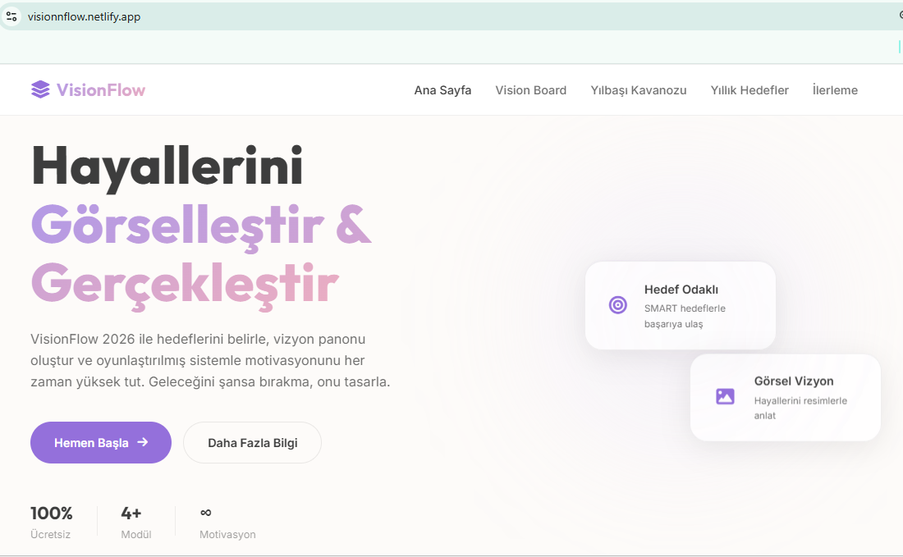
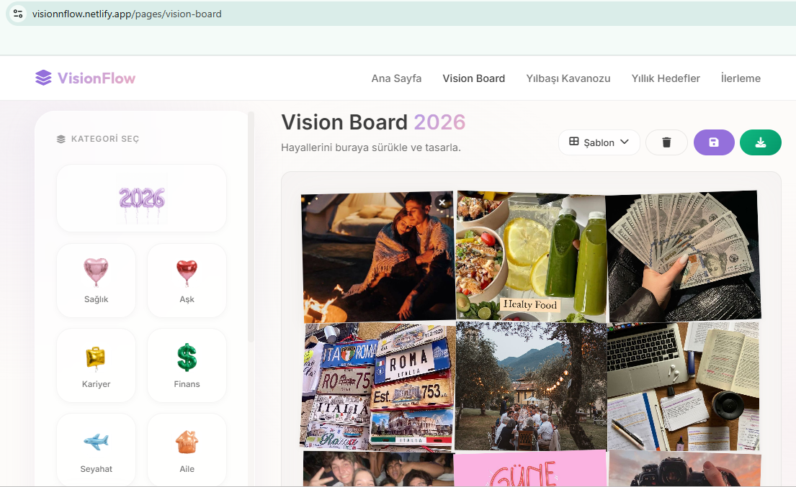
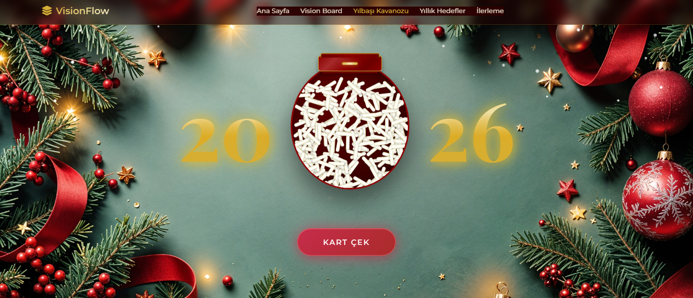
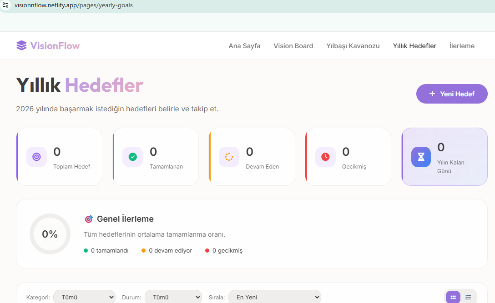
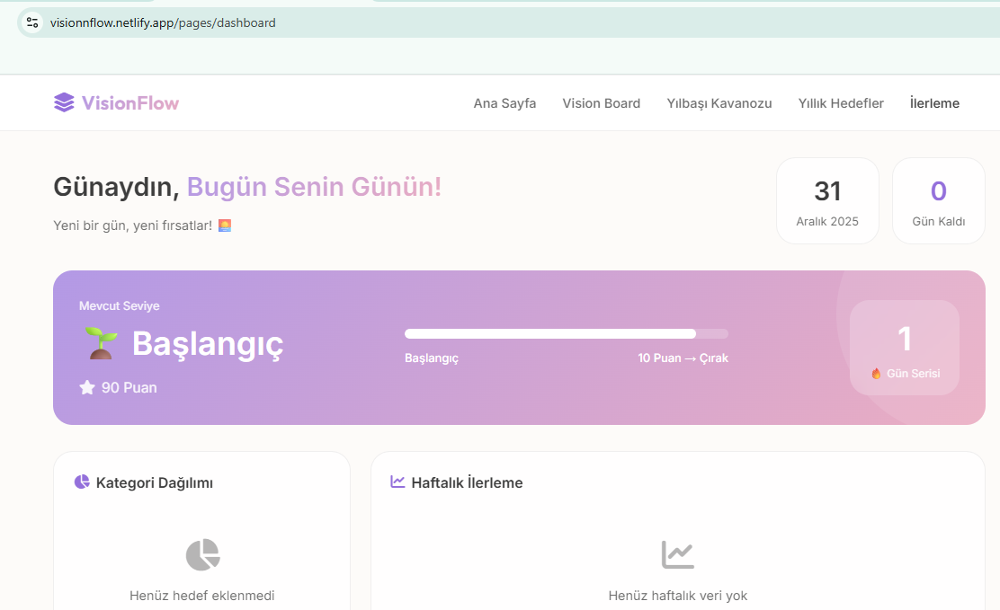

# ✨ VisionFlow 2026 - Hayallerini Tasarla




**VisionFlow 2026**, yeni yılda hedeflerinizi belirlemenize, vizyonunuzu görselleştirmenize ve motivasyonunuzu her zaman yüksek tutmanıza yardımcı olan modern, interaktif bir web uygulamasıdır. "Hayallerini Görselleştir & Gerçekleştir" mottosuyla yola çıkan bu proje, klasik hedef belirleme yöntemlerini oyunlaştırılmış ve estetik bir deneyimle birleştirir.

##  Proje Hakkında

Bu proje, sadece bir "yapılacaklar listesi" uygulamasından öte, kullanıcının 2026 vizyonunu bütünsel olarak ele almasını sağlar. Kullanıcı dostu arayüzü, akıcı animasyonları ve "Glassmorphism" tasarım dili ile premium bir deneyim sunar.

### Öne Çıkan Özellikler

*   **🎨 Vision Board (Vizyon Panosu):** Hayallerinizi resimler, ikonlar ve motivasyon sözleri ile görselleştirebileceğiniz, sürükle-bırak destekli interaktif bir pano.
*   **🏺 Yılbaşı Kavanozu (New Year Jar):** Yıl boyunca yaşadığınız güzel anıları, başarıları ve minnettarlık duyduğunuz anları sanal bir kavanozda biriktirin.
*   **🎯 Yıllık Hedefler (Yearly Goals):** SMART (Ölçülebilir, Erişilebilir, vb.) hedefler belirleyin, bunları alt görevlere bölün ve ilerleme durumunuzu takip edin.
*   **📊 İlerleme Paneli (Dashboard):** Tüm hedeflerinizin genel durumunu grafiklerle izleyin, istatistiklerinizi görün ve rozetler kazanın.
*   **📱 Tam Duyarlı Tasarım:** Mobil, tablet ve masaüstü cihazlarda kusursuz çalışan responsive yapı.

---

## 📸 Ekran Görüntüleri

Projenin her sayfasından görseller aşağıda yer almaktadır.


### 🎨 Vision Board Sayfası
Kullanıcıların hayallerini tasarladığı yaratıcı çalışma alanı.


### 🏺 Yılbaşı Kavanozu Sayfası
Kullanıcıların sihirli bir kavanozdan rastgele dilek kartları çekerek 2026 için sürpriz motivasyon mesajları aldığı interaktif sayfa.


### 🎯 Yıllık Hedefler Sayfası
Hedeflerin detaylandırıldığı ve yönetildiği liste görünümü.


### 📊 İlerleme (Dashboard) Sayfası
Genel durumun ve istatistiklerin özetlendiği yönetim paneli.



---

## 🛠️ Teknolojiler

Bu proje, modern web geliştirme standartlarına uygun olarak aşağıdaki teknolojilerle geliştirilmiştir:

*   **HTML5:** Semantik yapı ve SEO uyumluluğu.
*   **CSS3:**
    *   Responsive Tasarım (Flexbox & Grid)
    *   Glassmorphism Efektleri
    *   Custom Animations & Keyframes
    *   CSS Variables (Değişkenler)
*   **JavaScript (ES6+):** DOM manipülasyonu, modüler yapı ve etkileşimli özellikler.
*   **Kütüphaneler & Fontlar:**
    *   [Font Awesome](https://fontawesome.com/): İkon setleri için.
    *   [Google Fonts](https://fonts.google.com/): Tipografi için (Inter ve Outfit font aileleri).

---

## 📂 Proje Yapısı

```
vision_board-main/
├── index.html              # Ana giriş sayfası (Landing Page)
├── pages/                  # Uygulama sayfaları
│   ├── vision-board.html   # Vizyon panosu sayfası
│   ├── new-year-jar.html   # Yılbaşı kavanozu sayfası
│   ├── yearly-goals.html   # Hedefler sayfası
│   └── dashboard.html      # İlerleme paneli
├── css/                    # Stil dosyaları
│   ├── main.css            # Ana stiller
│   ├── components.css      # Buton, kart vb. bileşen stilleri
│   ├── animations.css      # Animasyon tanımları
│   └── mobile-nav.css      # Mobil menü stilleri
├── js/                     # JavaScript dosyaları
│   ├── app.js              # Ana uygulama mantığı
│   └── mobile-nav.js       # Mobil navigasyon scripti
└── assets/                 # Görseller ve diğer kaynaklar
```

---

## 💻 Kurulum ve Çalıştırma

Bu proje statik bir web uygulamasıdır, dolayısıyla herhangi bir karmaşık kuruluma veya backend sunucusuna ihtiyaç duymaz.

1.  **Projeyi İndirin:** Bu repoyu bilgisayarınıza klonlayın veya ZIP olarak indirin.
    ```bash
    git clone https://github.com/kullaniciadi/vision-board.git
    ```
2.  **Klasörü Açın:** Proje klasörüne gidin.
3.  **Başlatın:** `index.html` dosyasına çift tıklayarak tarayıcınızda açın.
    *   *Öneri:* Daha iyi bir geliştirme deneyimi için VS Code kullanıyorsanız "Live Server" eklentisi ile açmanız tavsiye edilir.

---

## 🤝 Katkıda Bulunma

1.  Bu projeyi Fork'layın.
2.  Yeni bir özellik dalı (branch) oluşturun (`git checkout -b ozellik/YeniOzellik`).
3.  Değişikliklerinizi commit edin (`git commit -m 'Yeni özellik eklendi'`).
4.  Dalınızı (branch) Push edin (`git push origin ozellik/YeniOzellik`).
5.  Bir Pull Request oluşturun.

---

## 📄 Lisans

Bu proje [MIT](LICENSE) lisansı altında lisanslanmıştır.

---

<p align="center">
  2026 VisionFlow &copy; ❤️ ile tasarlanmıştır.
</p>
